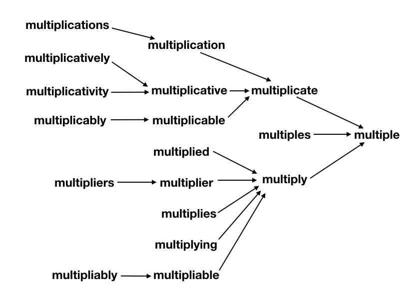

# Lemmatization

Lemmatization is a linguistic process that involves reducing words to their base or dictionary form, known as a lemma. The goal of lemmatization is to transform different inflected forms of a word into a common base form, which simplifies analysis and comparison.

## Working

Consider the following sentence: "The cats are chasing mice."

1. **Tokenization**: First, the sentence is tokenized into individual words: ["The", "cats", "are", "chasing", "mice"].

2. **Part-of-Speech Tagging**: Each word is tagged with its part of speech. For example, "cats" is a noun (NN), "are" is a verb (VBP), and so on.

3. **Lemmatization**: Lemmatization then transforms each word into its base form. For nouns and verbs, this typically involves finding the lemma in a dictionary. For example:
   - "The" remains "The" because it is a determiner.
   - "cats" becomes "cat" (singular noun lemma).
   - "are" becomes "be" (base form of the verb "to be").
   - "chasing" becomes "chase" (base form of the verb "chase").
   - "mice" becomes "mouse" (singular noun lemma).

4. **Output**: The lemmatized sentence becomes: "The cat be chase mouse."

By lemmatizing words, we can ensure that different grammatical forms of the same word are treated as the same word, which is beneficial for tasks like text analysis, information retrieval, and natural language processing.

It's essential to note that lemmatization typically requires knowledge of the language's morphology and a dictionary (or lexicon) containing the base forms of words. Tools like NLTK (Natural Language Toolkit) and SpaCy provide lemmatization functionality in various languages.

## Types of Lemmatization

Lemmatization can be approached in various ways, depending on the specific requirements of the task, the language being processed, and the available resources. Here are some different types of lemmatization techniques:

1. **Dictionary-Based Lemmatization**: This approach uses a predefined dictionary or lexicon containing mappings of words to their base forms (lemmas). It looks up each word in the dictionary and replaces it with its corresponding lemma. This method is straightforward and accurate but requires a comprehensive dictionary for each language.

2. **Rule-Based Lemmatization**: Rule-based lemmatization involves applying linguistic rules to derive the base form of a word. These rules may consider factors such as part of speech, suffixes, prefixes, and irregularities in word formation. While this method can handle a wide range of words, it may require extensive rule sets and language-specific knowledge.

3. **Morphological Analysis**: Morphological analysis involves analyzing the structure of words to identify their morphemes (the smallest meaningful units). By understanding how affixes and other modifications alter the base form of a word, morphological analysis can accurately lemmatize words. However, it requires sophisticated algorithms and linguistic knowledge.

4. **Statistical Lemmatization**: Statistical approaches use machine learning algorithms trained on large corpora to predict the base form of words based on context. These models learn patterns in how words are used and can generalize to unseen data. Statistical lemmatization methods can be effective for languages with complex morphology but require substantial computational resources and training data.

5. **Hybrid Approaches**: Hybrid methods combine two or more of the above techniques to achieve better performance. For example, a system might use a dictionary-based approach as the primary method and fall back on rule-based or statistical methods for words not found in the dictionary. Hybrid approaches aim to leverage the strengths of different techniques while mitigating their weaknesses.

The choice of lemmatization technique depends on factors such as the complexity of the language, the availability of linguistic resources, the desired level of accuracy, and the computational resources available for processing. In practice, a combination of methods may be used to achieve the best results.